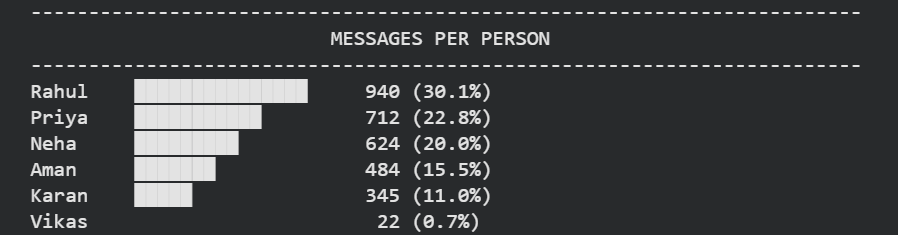
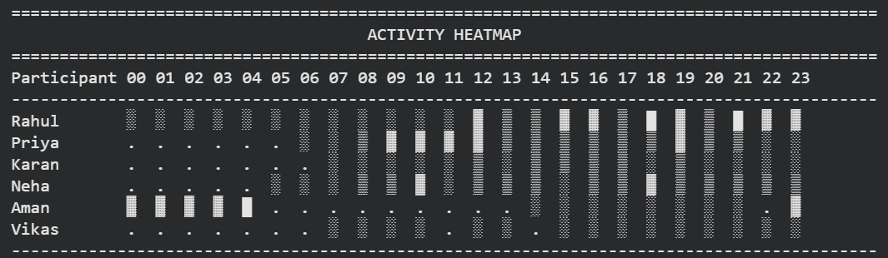
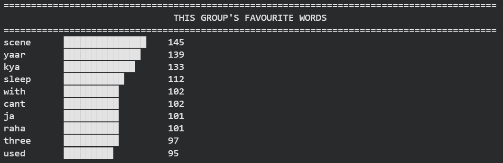
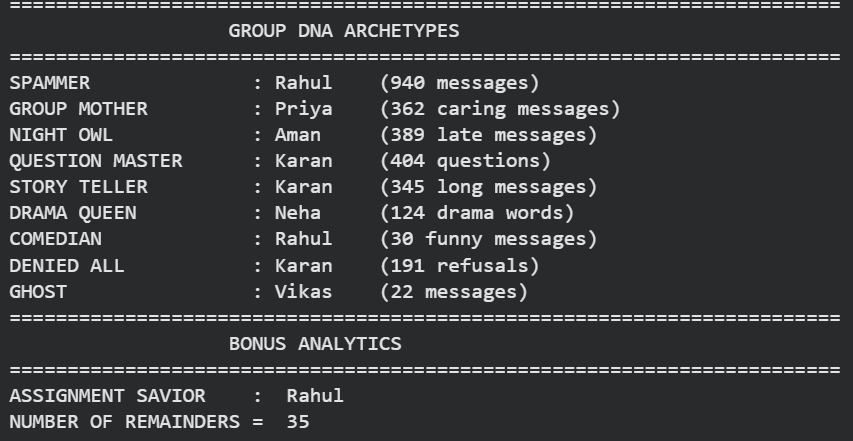

# 📱 WhatsApp GroupDNA Analyzer

A Python project that analyzes WhatsApp group chats and generates meaningful communication insights using only Python Fundamentals.

---

## 📌 Project Overview

This project reads a WhatsApp chat export and performs multiple analyses to understand group communication patterns.

The project was developed as part of a Data Science Minor Project using only Python fundamentals, dictionaries, loops, strings, file handling, and datetime functions.

---

## ✨ Features

✅ Group Overview

✅ Total Messages

✅ Total Participants

✅ Messages Per Person

✅ Busiest Day

✅ Busiest Hour

✅ Activity Heatmap

✅ Favourite Words Analysis

✅ Night Owl Detection

✅ Assignment Reminder Detection

✅ Longest Silent Streak

✅ Personality Archetypes

- The Spammer
- The Group Mom
- The Night Owl
- The Storyteller
- The Drama Queen
- The Ghost

---

## 🛠 Technologies Used

- Python
- Dictionaries
- Lists
- Loops
- Functions
- String Methods
- File Handling
- Datetime Module

No external data analysis libraries (Pandas, Matplotlib, etc.) were used.

---

## 📂 Project Structure

```
WhatsApp-GroupDNA-Analyzer/
│
├── WhatsApp_GroupDNA_Analyzer.ipynb
├── DADS Minor PROJECT dataset.txt
├── README.md
└── screenshots/
```

---

## 📊 Sample Outputs

### Group Overview

![Group Overview].(Screenshot 2026-07-24 155530.png)

### Messages Per Person



### Activity Heatmap



### Favourite Words



### Personality Archetypes




---

## 📁 Dataset

The dataset used for this project is included in this repository.

- **File:** [`dataset.txt`](dataset.txt)
- **Format:** WhatsApp Chat Export (.txt)
- **Purpose:** Used for communication pattern analysis.
---

## 🎯 Learning Outcomes

Through this project, I learned:

- File Parsing
- Dictionary-based Analytics
- String Processing
- Date & Time Analysis
- Data Visualization using Text
- Problem Solving using Python Fundamentals

---

## 👩‍💻 Author

**B R Tanmayee**

Engineering Student | CSE (Data Science)

[](https://github.com/Tanmayee0607)

[](https://www.linkedin.com/in/b-r-tanmayee-068014372)


---

---


